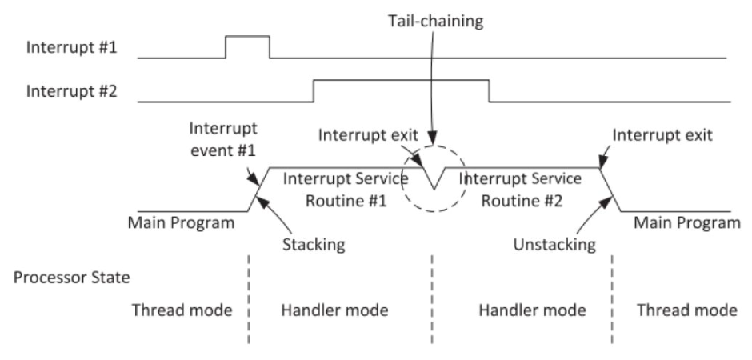
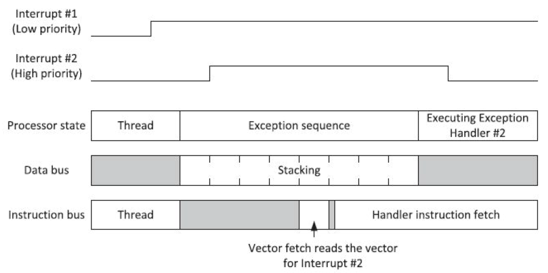
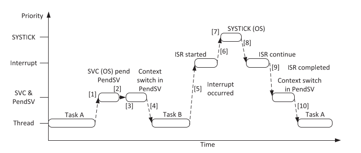
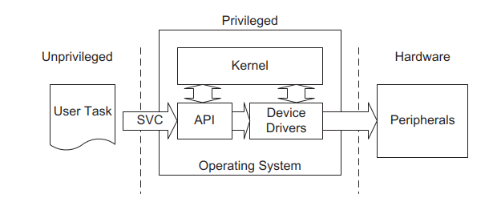

# Preguntas orientadoras 

### Pregunta 1
### Describa brevemente los diferentes perfiles de familias de microprocesadores/microcontroladores de ARM. Explique alguna de sus diferencias características.
    ARM cuenta con 3 familias o perfiles denominados

        Cortex A (Application)
        Cortex R (Real time)
        Cortex M (Microcontroller)

    Los Cortex A son procesadores de alto rendimiento y se utilizan con sistemas operativos de alta performance (por ej. 
    Android). Permiten alto nivel de paralelismo, pueden contar con mas de un nucleo (multinucleo), corren a alta frecuencia
    (mayor a 1GHz), incluyen gran cantidad de memoria RAM y tienen memoria CACHE.

    Lor Cortex R estan orientados a las aplicaciones de tiempo real que requieren baja latencia, alto determinismo y gran 
    capacidad de computo. Se adecuan a las aplicaciones de sistemas criticos en industrias como medicina y automotor.

    Los Cortex M son procesadores de proposito general, orientados a sistemas embebidos compactos y de consumo masivo. Pueden
    correr gran cantidad de codigo y se los puede programar integramente en C.

## Cortex M

### Pregunta 1
### Describa brevemente las diferencias entre las familias de procesadores Cortex M0, M3 y M4.

| ARM Cortex M | Systick Timer | Bit-Banding | MPU | Mem. Arch. | ARM Arch. | Thumb  | Thumb-2 | HW Multiply    | HW Divide | DSP | FPU     |
|:-------------|:-------------:|:-----------:|:---:|:----------:|:---------:|:------:|:-------:|:--------------:|:---------:|:---:|:-------:|
| M0           | Optional      | Optional    | NO  | Von neumann| ARMv6-M   | Most   | Some    | 32bit result   | NO        | NO  | NO      |
| M0+          | Optional      | Optional    | Opt | Von neumann| ARMv6-M   | Most   | Some    | 32bit result   | NO        | NO  | NO      |
| M3           | YES           | Optional    | Opt | Harvard    | ARMv7-M   | Entire | Entire  | 32/64bit result| YES       | NO  | NO      |
| M4           | YES           | Optional    | Opt | Harvard    | ARMv7E-M  | Entire | Entire  | 32/64bit result| YES       | YES | Opt. SP |

### Pregunta 2
### ¿Por qué se dice que el set de instrucciones Thumb permite mayor densidad de código? Explique.
    Las intrucciones Thumb son instrucciones de 16 bits de longitud, la mitad de lo que ocupa el juego de instrucciones estandard
    de ARM. Las instrucciones Thumb son las que se utilizan con mayor frecuencia y al ocupar solo 2 bytes disminuyen la cantidad 
    de memoria de codigo mejorando su densidad. 

### Pregunta 3
### ¿Qué entiende por arquitectura load-store? ¿Qué tipo de instrucciones no posee este tipo de arquitectura? 
    La arquitectura load-store refiere a que cualquier operacion que se quiera realizar con datos guardados en memoria, primero
    deben ser cargados en registros del procesador (load) luego realizar la operacion y finalmente almacenar el resultado en
    memoria (store). 
    Este tipo de arquitectura no permite hacer operaciones con los datos en memoria de forma directa. Es decir, si quisiera
    sumar lo que tengo en Mem1 y Mem2 y el resultado guardarlo en Mem3, debo primero cargar Mem1 y Mem2 en 2 registros, la suma
    se guardará en registro y luego se deberá mover este ultimo registro a Mem3.

### Pregunta 4	
### ¿Cómo es el mapa de memoria de la familia?  

### Pregunta 5
### ¿Qué ventajas presenta el uso de los “shadowed pointers” del PSP y el MSP? 
    La ventaja radica en tener separada la memoria de stack para el codigo que corre en modo privilegiado y el que corre en modo 
    no provilegiado. Esto permite un mejor manejo del stack para distintos procesos reduciendo la probabilidad de comoter 
    errores al momento de guardar y recuperar datos en el stack.

### Pregunta 6	
### Describa los diferentes modos de privilegio y operación del Cortex M, sus relaciones y como se conmuta de uno al otro. Describa un ejemplo en el que se pasa del modo privilegiado a no privilegiado y nuevamente a privilegiado.
    Cortex M posee 2 modos de operacion: Thread Mode y Handler Mode.
    En modo Thread el codigo se ejecuta de manera normal y en el modo Handler se ejecuta el codigo que pertenece a las rutinas 
    de exepcion o interrupcion.
    A su vez, en el modo Thread existen 2 niveles de acceso: uno privilegiado y otro no privilegiado. El modo Handler siempre
    tiene nivel de acceso privilegiado.
    Cuando el microcrontrolador arranca amanece en modo  Thread privilegiado, si ocurre una exepcion o interrupcion el micro 
    pasará a modo Handler y luego de finalizar la atencion de la rutina retornará al codigo principal en modo Thread (ver figura 
    abajo).
    
    
    El microcrontraldor puede pasar de modo privilegiado a no privilegiado escribiendo el registro de control correspondiente.
    Estando en modo no privilegiado NO puede volver al modo privilegiado, primero debe pasar al modo Handler y desde alli podra 
    decidir si retorna al modo no privilegiado o al modo privilegiado (ver siguiente figura).

### Pregunta 7
### ¿Qué se entiende por modelo de registros ortogonal? Dé un ejemplo. 
    El modelo de registros ortogonal significa que cualquier instruccion que pueda aplicarse a un registro también puede 
    aplicarse a cualquier otro registro. Esto es valido para los registros r0 a r13. En cambio existen instrucciones que
    tratan a r14 y r15 de manera diferente.

### Pregunta 8	
### ¿Qué ventajas presenta el uso de intrucciones de ejecución condicional (IT)? Dé un ejemplo. 
    Esta instruccion permite realizar el control de flujo del programa sin romper el pipeline. Por ejemplo:

    ITET GT
    ADDGT R0,R0,R1
    ADDLE R0,R0,R2
    ADDGT R5,R6,#5 

    Si el Flag GT es "1" se ejecuta el primer ADD y el tercer ADD (ADDGT R0,R0,R1 y ADDGT R5,R6,#5) , sino, 
    se ejecuta solo el segundo ADD (ADDLE R0,R0,R2)

### Pregunta 9
### Describa brevemente las excepciones más prioritarias (reset, NMI, Hardfault).
    Reset: se ejecuta al iniciar el microcrontrolador (al momento de ser energizado).
    NMI: es la interrupcion no enmascarable, normalmente se le asocian funciones para controlar el sistema: el Watch Dog Timer 
    o el brownout detector.
    Hardfault: esta excepcion ocurre ante toda clase de falla interna del procesador como uso indebido de memoria
    dinamica, inicializacion incorrecta de perfericos, etc.  

### Pregunta 10
### Describa las funciones principales de la pila. ¿Cómo resuelve la arquitectura el llamado a funciones y su retorno?
    La pila puede:
        
        - Guardar variables locales
        - Pasar datos a funciones o subrutinas
        - Guardar el estado del procesador y de los registros de proposito general cuando ocurre un cambio de contexto, 
          esto se conoce com "stacking"
    
    Cuando hay un llamado a funcion el controlador guarda en la pila los registros del procesador y la direccion de retorno.
    Luego ejecuta la funcion y a su retorno recupera de la pila la direccion donde debe retornar y los registros del procesador
    asegurando que las condiciones sigan siendo las mismas anted de la llamada a la funcion. 

### Pregunta 11
### Describa la secuencia de reset del microprocesador.  
    El microcrocontrolador primero de todo inicializa el puntero a la pila, es deir, carla la posicion de memoria de la pila en
    el registro r13. Seguido realiza un salto a la direccion de memoria contenida en el vector de reset, esta direccion de 
    memoria es el inicio del codigo de programa. 

### Pregunta 12
### ¿Qué entiende por “core peripherals”? ¿Qué diferencia existe entre estos y el resto de los periféricos? 
    Core peripheral se refiere a los perifericos que posee el microprocesador ARM en su nucleo (por ej. NIVIC, SysTick Timer, 
    MPU, FPU, DSP). 
    El resto de los perifericos son todos aquellos que estan por fuera del nucleo de ARM y que agrega el fabricante del 
    microcontrolador como por ej. UART, I2C, SPI, DMA etc. 

### Pregunta 13
### ¿Cómo se implementan las prioridades de las interrupciones? Dé un ejemplo.
    Los cortex-M3/M4 soportan tres niveles de prioridad fijos (los mas altos) y hasta 256 niveles de prioridad programables.
    Normalmente en la mayoria de los sistemas se necesitan algunos pocos niveles de prioridad. La cantidad de niveles se 
    puede ajustar en 4, 8, 16, 32 ..... hasta el maximo. Para esto se configura un registro de nivel de prioridad.
    Tambien se pueden configurar sub-prioridades. La sub-prioridad es usada cuando 2 interrupciones del mismo nivel de
    prioridad ocurren al mismo tiempo, en este caso se ejecutará primero la que tenga mayor sub-prioridad.  

### Pregunta 14
### ¿Qué es el CMSIS? ¿Qué función cumple? ¿Quién lo provee? ¿Qué ventajas aporta?
    CMSIS es un conjunto de librerias que implementan una capa de abstraccion de hardware para los Cortex M.
    Estas librerias estan escritas en C, las provee ARM y brindan funciones para interectuar con los perfericos del nucleo
    (Core peripherals) asi como para interactuar con un RTOS (Real Time Operating System) 

### Pregunta 15
### Cuando ocurre una interrupción, asumiendo que está habilitada ¿Cómo opera el microprocesador para atender a la subrutina correspondiente? Explique con un ejemplo.
    1) Se envía una solicitud de interrupción al procesador.
    2) El procesador suspende la tarea que se está ejecutando actualmente.
    3) El procesador ejecuta la Rutina de Servicio de Interrupción (ISR) y, opcionalmente, borrar la solicitud de interrupción 
       mediante software si es necesario.
    4) El procesador reanuda la tarea previamente suspendida.

### Pregunta 16
### ¿Cómo cambia la operación de stacking al utilizar la unidad de punto flotante?
    Cuando se utiliza la FPU el controlador debe guardar en el stack mas registros. A R0-R3, R12, LR, xPSR se suman los 
    registros S0-S15, FPSCR.

### Pregunta 17
### Explique las características avanzadas de atención a interrupciones: tail chaining y late arrival.
    Tail chaining: este mecanismo actua cuando al estar ejecutandose una rutina de interrupcion aparece otra interrupcion de
    igual o menor prioridad. El controlador terminará de ejecutar la rutina de la primera interrpcion y luego ejecutará la 
    rutina de la segunda interrupcion. No se hace un cambio de contexto porque no es necesario.

    
    
    Late arrival: este mecanismo actua cuando al momento de estar realizando el stacking de una interrupcion aparece otra 
    interrupcion de mayor prioridad. El controlador terminará de realizar el stacking, luego atenderá la rutina de la 
    interrupcion de mayor priridad y luego a traves del mecanismo tail chaining terminará atendiendo la rutina de la 
    primer interrupcion (de menor prioridad).

### Pregunta 18
### ¿Qué es el systick? ¿Por qué puede afirmarse que su implementación favorece la portabilidad de los sistemas operativos embebidos?
    El systick es un temporizador integrado dentro del nucleo ARM y tiene una longitud de 24 bits. Ya por el hecho de estar 
    integrado en el nucleo del microprocesador cualquier fabricante que implemente su microcontrolador con un nucleo ARM permitirá 
    su uso favoreciendo la portabilidad de los sistemas operativos o programas que lo utilicen.

### Pregunta 19
### ¿Qué funciones cumple la unidad de protección de memoria (MPU)?
    La MPU tiene como funcion principal proteger el acceso a memoria. De esta manera podemos:
        - Prevenir que las aplicaciones (tareas) accedan a zonas de memoria de otras aplicaciones o del kernel de un SO.
        - Prevenir que las aplicaciones accedan a periféricos sin los permisos adecuados.
        - Evitar que se ejecute código desde zonas no permitidas (ejemplo desde la RAM).

### Pregunta 20
### ¿Cuántas regiones pueden configurarse como máximo? ¿Qué ocurre en caso de haber solapamientos de las regiones? ¿Qué ocurre con las zonas de memoria no cubiertas por las regiones definidas?
    Se pueden configurar hasta 8 regiones de memoria.
    El solapamiento de regiones esta permitido. Las direcciones de memoria solapadas mantendrán sus atributos de acceso y 
    permisos iguales a los de la region de numero mas alto.
    Si la MPU esta habilitada, la zona de memoria que no este cubierta por alguna zona definida quedará inutilizada. Es decir al
    querer acceder a una direccion de memoria no definida en la MPU se disparará una excepción por falla.      

### Pregunta 21
### ¿Para qué se suele utilizar la excepción PendSV? ¿Cómo se relaciona su uso con el resto de las excepciones? Dé un ejemplo.
    La excepcion PendSV se utiliza para realizar el cambio de contexto en un sistema operativo (cambio de tareas).
    Veamos un ejemplo:  
    1) La tarea A llama a SVC para realizar un cambio de tarea.
    2) El sistema operativo recibe la solicitud, se prepara para el cambio de contexto y espera la Excepción PendSV.
    3) Cuando la CPU sale de SVC, ingresa inmediatamente a PendSV y realiza el cambio de contexto.
    4) Cuando PendSV finaliza y regresa al modo thread y ejecuta la tarea B.
    5) Se produce una interrupción.
    6) Mientras se ejecuta la rutina de interrupciones, se produce una excepción SYSTICK.
    7) El sistema operativo lleva a cabo su operación, luego espera la excepción PendSV y se prepara para el cambio de contexto.
    8) Cuando sale de la excepción SYSTICK, regresa a la rutina de interrupción.
    9) Cuando se completa la rutina de interrupción, el PendSV se inicia y realiza las operaciones de cambio de contexto.
    10) Cuando se completa PendSV, el programa vuelve al modo thread para retomar la ejecucion de la tarea A.

    
### Pregunta 22
### ¿Para qué se suele utilizar la excepción SVC? Expliquelo dentro de un marco de un sistema operativo embebido.
    La excepción SVC es una excepción por software que se llama a traves de la instrucción SVC. Los sistemas operativos la 
    utilizan para el llamado a funciones propias del S.O. o para acceder al uso de recursos de un sistema desde una aplicacion 
    (Device Driver).

## ISA

### Pregunta 1.	
### ¿Qué son los sufijos y para qué se los utiliza? Dé un ejemplo.
    Los sufijos son codigos que se colocan a continuación de una instrucción en assembly y se los utiliza para:
    
    1) Actualizar el registro de estados (APSR) cuando se ejecuta una instrucción (sufijo S).
    2) Para ejecutar una instrucción de forma condicional (sufijo EQ, NE, CS, CC, MI, PL, VS, VC, HI, LS, GE, LT, GT, LE).
    3) Seleccionar el uso de instrucciones de 16 bit o 32 bits (sufijo .N , .W).

    Por ejemplo, para el caso 1:

MOV  R0, R1 ; mueve R1 a R0 y no actualiza APSR
MOVS R0, R1 ; mueve R1 a R0 y actualiza APSR

    Para el caso 2:

ADDEQ R0, R1, R2  ; ejecuta R0=R1+R2 solo si el resultado de la operacion previa seteó el flag "Equal" en 1

### Pregunta 2	
### ¿Para qué se utiliza el sufijo ‘s’? Dé un ejemplo.
    Se utiliza para actualizar el registro de estados (APSR) cuando se ejecuta una instrucción.

MOV  R0, #0x0A10 ; mueve valor a R0 y no actualiza APSR
MOVS R0, #0x0A10 ; mueve valor a R0 y actualiza APSR

### Pregunta 3
### ¿Qué utilidad tiene la implementación de instrucciones de aritmética saturada? Dé un ejemplo con operaciones con datos de 8 bits.
    Las instrucciones de aritmética saturada evitan que se produzca un overflow manteniendo un valor entre su máximo y su minimo.
    Por ejemplo:

SSAT R1, #8, R0  ; Toma el registro R0 y lo mueve al registro R1 con R0 > 127 ==> R1=127 / R0 < -128 ==> R=-128

### Pregunta 4	
### Describa brevemente la interfaz entre assembler y C ¿Cómo se reciben los argumentos de las funciones? ¿Cómo se devuelve el resultado? ¿Qué registros deben guardarse en la pila antes de ser modificados? 

### Pregunta 5	
### ¿Qué es una instrucción SIMD? ¿En qué se aplican y que ventajas reporta su uso? Dé un ejemplo.
