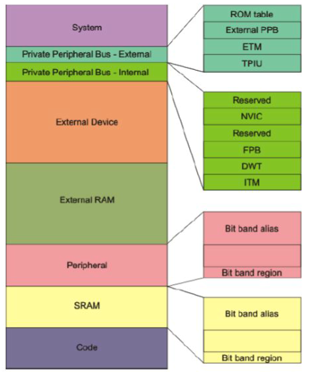
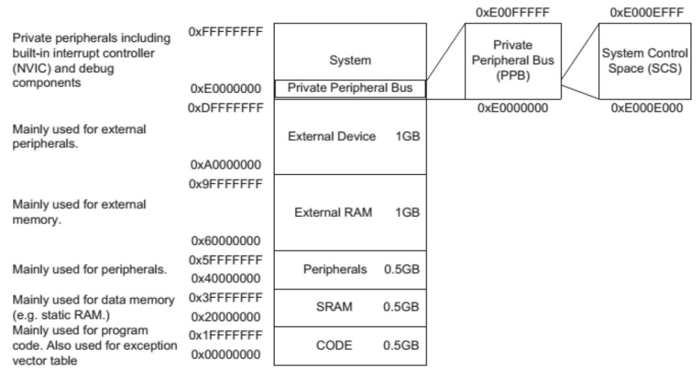
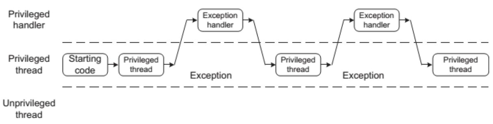
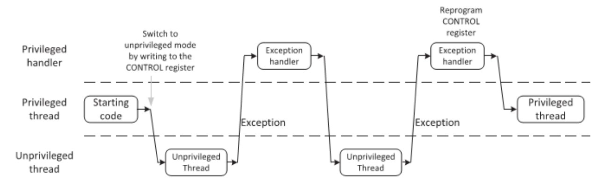

# Preguntas orientadoras 

### Pregunta 1
### Describa brevemente los diferentes perfiles de familias de microprocesadores/microcontroladores de ARM. Explique alguna de sus diferencias características.
    ARM cuenta con 3 familias o perfiles denominados

        Cortex A (Application)
        Cortex R (Real time)
        Cortex M (Microcontroller)

    Los Cortex A son procesadores de alto rendimiento y se utilizan con sistemas operativos de alta performance (por ej. Android).
    Permiten alto nivel de paralelismo, pueden contar con mas de un nucleo (multinucleo), corren a alta frecuencia (mayor a 1GHz),
    incluyen gran cantidad de memoria RAM y tienen memoria CACHE.

    Lor Cortex R estan orientados a las aplicaciones de tiempo real que requieren baja latencia, alto determinismo y gran 
    capacidad de computo. Se adecuan a las aplicaciones de sistemas criticos en industrias como medicina y automotor.

    Los Cortex M son procesadores de proposito general, orientados a sistemas embebidos compactos y de consumo masivo. Pueden 
    correr gran cantidad de codigo y se los puede programar integramente en C.

## Cortex M

### Pregunta 1
### Describa brevemente las diferencias entre las familias de procesadores Cortex M0, M3 y M4.

| ARM Cortex M | Systick Timer | Bit-Banding | MPU | Mem. Arch. | ARM Arch. | Thumb  | Thumb-2 | HW Multiply    | HW Divide | DSP | FPU     |
|:-------------|:-------------:|:-----------:|:---:|:----------:|:---------:|:------:|:-------:|:--------------:|:---------:|:---:|:-------:|
| M0           | Optional      | Optional    | NO  | Von neumann| ARMv6-M   | Most   | Some    | 32bit result   | NO        | NO  | NO      |
| M0+          | Optional      | Optional    | Opt | Von neumann| ARMv6-M   | Most   | Some    | 32bit result   | NO        | NO  | NO      |
| M3           | YES           | Optional    | Opt | Harvard    | ARMv7-M   | Entire | Entire  | 32/64bit result| YES       | NO  | NO      |
| M4           | YES           | Optional    | Opt | Harvard    | ARMv7E-M  | Entire | Entire  | 32/64bit result| YES       | YES | Opt. SP |

### Pregunta 2
### ¿Por qué se dice que el set de instrucciones Thumb permite mayor densidad de código? Explique.
    Las intrucciones Thumb son instrucciones de 16 bits de longitud, la mitad de lo que ocupa el juego de instrucciones estandard
    de ARM. Las instrucciones Thumb son las que se utilizan con mayor frecuencia y al ocupar solo 2 bytes disminuyen la cantidad 
    de memoria de codigo mejorando su densidad. 

### Pregunta 3
### ¿Qué entiende por arquitectura load-store? ¿Qué tipo de instrucciones no posee este tipo de arquitectura? 
    La arquitectura load-store refiere a que cualquier operacion que se quiera realizar con datos guardados en memoria, primero 
    deben ser cargados en registros del procesador (load) luego realizar la operacion y finalmente almacenar el resultado en 
    memoria (store). 
    Este tipo de arquitectura no permite hacer operaciones con los datos en memoria de forma directa. Es decir, si quisiera sumar 
    lo que tengo en Mem1 y Mem2 y el resultado guardarlo en Mem3, debo primero cargar Mem1 y Mem2 en 2 registros, la suma se 
    guardará en registro y luego se deberá mover este ultimo registro a Mem3.

### Pregunta 4	
### ¿Cómo es el mapa de memoria de la familia?  

### Pregunta 5
### ¿Qué ventajas presenta el uso de los “shadowed pointers” del PSP y el MSP? 
    La ventaja radica en tener separada la memoria de stack para el codigo que corre en modo privilegiado y el que corre en modo 
    no provilegiado. Esto permite un mejor manejo del stack para distintos procesos reduciendo la probabilidad de comoter 
    errores al momento de guardar y recuperar datos en el stack.

### Pregunta 6	
### Describa los diferentes modos de privilegio y operación del Cortex M, sus relaciones y como se conmuta de uno al otro. Describa un ejemplo en el que se pasa del modo privilegiado a no privilegiado y nuevamente a privilegiado.
    Cortex M posee 2 modos de operacion: Thread Mode y Handler Mode.
    En modo Thread el codigo se ejecuta de manera normal y en el modo Handler se ejecuta el codigo que pertenece a las rutinas 
    de exepcion o interrupcion.
    A su vez, en el modo Thread existen 2 niveles de acceso: uno privilegiado y otro no privilegiado. El modo Handler siempre
    tiene nivel de acceso privilegiado.
    Cuando el microcrontrolador arranca amanece en modo  Thread privilegiado, si ocurre una exepcion o interrupcion el micro 
    pasará a modo Handler y luego de finalizar la atencion de la rutina retornará al codigo principal en modo Thread (ver figura 
    abajo).
    
    El microcrontraldor puede pasar de modo privilegiado a no privilegiado escribiendo el registro de control correspondiente.
    Estando en modo no privilegiado NO puede volver al modo privilegiado, primero debe pasar al modo Handler y desde alli podra 
    decidir si retorna al modo no privilegiado o al modo privilegiado (ver siguiente figura).

### Pregunta 7
### ¿Qué se entiende por modelo de registros ortogonal? Dé un ejemplo. 

### Pregunta 8	
### ¿Qué ventajas presenta el uso de intrucciones de ejecución condicional (IT)? Dé un ejemplo. 

### Pregunta 9
### Describa brevemente las excepciones más prioritarias (reset, NMI, Hardfault).

### Pregunta 10
### Describa las funciones principales de la pila. ¿Cómo resuelve la arquitectura el llamado a funciones y su retorno?

### Pregunta 11
### Describa la secuencia de reset del microprocesador.  
    El microcrocontrolador primero de todo inicializa el puntero a la pila, es deir, carla la posicion de memoria de la pila en 
    el registro r13. Seguido realiza un salto a la direccion de memoria contenida en el vector de reset, esta direccion de memoria 
    es el inicio del codigo de programa. 

### Pregunta 12
### ¿Qué entiende por “core peripherals”? ¿Qué diferencia existe entre estos y el resto de los periféricos? 

### Pregunta 13
### ¿Cómo se implementan las prioridades de las interrupciones? Dé un ejemplo.

### Pregunta 14
### ¿Qué es el CMSIS? ¿Qué función cumple? ¿Quién lo provee? ¿Qué ventajas aporta?

### Pregunta 15
### Cuando ocurre una interrupción, asumiendo que está habilitada ¿Cómo opera el microprocesador para atender a la subrutina correspondiente? Explique con un ejemplo.

### Pregunta 16
### ¿Cómo cambia la operación de stacking al utilizar la unidad de punto flotante?

### Pregunta 17
### Explique las características avanzadas de atención a interrupciones: tail chaining y late arrival.

### Pregunta 18
### ¿Qué es el systick? ¿Por qué puede afirmarse que su implementación favorece la portabilidad de los sistemas operativos embebidos?

### Pregunta 19
### ¿Qué funciones cumple la unidad de protección de memoria (MPU)?

### Pregunta 20
### ¿Cuántas regiones pueden configurarse como máximo? ¿Qué ocurre en caso de haber solapamientos de las regiones? ¿Qué ocurre con las zonas de memoria no cubiertas por las regiones definidas?

### Pregunta 21
### ¿Para qué se suele utilizar la excepción PendSV? ¿Cómo se relaciona su uso con el resto de las excepciones? Dé un ejemplo.

### Pregunta 22
### ¿Para qué se suele utilizar la excepción SVC? Expliquelo dentro de un marco de un sistema operativo embebido.

## ISA

### Pregunta 1.	
### ¿Qué son los sufijos y para qué se los utiliza? Dé un ejemplo.

### Pregunta 2	
### ¿Para qué se utiliza el sufijo ‘s’? Dé un ejemplo.

### Pregunta 3
### ¿Qué utilidad tiene la implementación de instrucciones de aritmética saturada? Dé un ejemplo con operaciones con datos de 8 bits.

### Pregunta 4	
### Describa brevemente la interfaz entre assembler y C ¿Cómo se reciben los argumentos de las funciones? ¿Cómo se devuelve el resultado? ¿Qué registros deben guardarse en la pila antes de ser modificados? 

### Pregunta 5	
### ¿Qué es una instrucción SIMD? ¿En qué se aplican y que ventajas reporta su uso? Dé un ejemplo.
